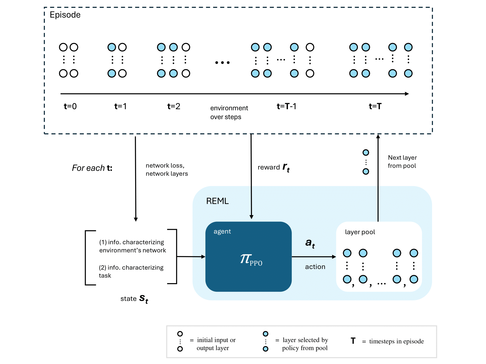

## Learning to Learn by Gradient Descent as a Discrete-Time Finite-Horizon Markov Decision Process (2024)

## Abstract
> Meta-learning, often referred to as ”learning to learn,” is a paradigm within
> machine learning that focuses on developing models that generalize knowledge across tasks. Such a model learns across tasks as it learns within tasks,
> enabling the model to adapt quickly to new, unseen tasks. A model for a new
> task can be generated with near-optimal parameters in no or very few training steps. 
> Meta-learning in machine learning is desirable in cases where there
> is limited data for a task or when a model needs to learn efficiently within
> few data samples. This thesis investigates whether Meta-learning can be cast
> as a Reinforcement learning (RL) problem for non-RL tasks. RL applied to
> Meta-learning has included hyperparameter search for neural architectures
> and meta-policies in RL task domains (Meta-Reinforcement Learning). RL
> has not been used to train models (parameter search) for non-RL tasks in the
> Meta-learning paradigm. This thesis asks: can Meta-learning be formulated
> as a sequential task? And if Meta-learning can be formulated as a sequential task, 
> can Meta-learning be a discrete-time finite-horizon MDP solved
> by deep RL? Reinforcement Meta-Learning (REML) is proposed to formulate the 
> Meta-learning task as composing neural networks layer by layer for
> sampled tasks with a shared parameter space across tasks. REML is evaluated 
> according to the protocol proposed by Finn et al (2018) as used for the
> Model-agonistic meta-learning (MAML) algorithm. REML is first tested on
> regression tasks as a series of varying sinusoidal curves. Performance is evaluated 
> looking at loss per step (convergence speed) for a model constructed
> by REML as compared to a model trained from scratch. REML is also tested
> on a few-shot learning task where it is given 5 and 10 samples and tested
> after 0, 1, and 10 gradient steps. Future work is to continue testing REML
> on classification and reinforcement learning tasks, and expanding the action
> space of REML to decide hyperparameters in addition to parameters.

## High level
REML casts “learning to learn” as an RL problem. The task given to REML
is to learn regression algorithms as sequences of neural network layers, 
for provided labeled regression datasets. The learning process across the set of 
datasets is represented as a discrete-time and finite-horizon MDP.

Training starts with sampling training tasks T and initializing a network N 
in the environment with an input layer I and output layer O from L. 
Each step, REML selects a layer from L to sequence in N based on the state s ∈ S. 
Training consists of episodes where an episode terminates when the sequenced network N reaches
a pre-defined depth. 

At the end of an episode, layers are trained with the Adam optimizer. 
The trained layer copies are then updated in the layer pool L. The idea is that 
knowledge acquired by REML is held by these updated layers in L with the policy 
serving as a map to rebuild a network it has made perform for the task or a related task in the past.

## MDP Formulation

The **state space** is composed of information characterizing the task T and infor
mation characterizing the network built so far in the current environment.
Information about the task is selected by the researcher to represent differ
ences across tasks in the domain. For example, if the task is regression on
varying sine curves, then the information could be what differentiates the
curves such as the amplitude and phase shift.

The **action space** is discrete in the size of the global layer pool. This pool 
includes the input, hidden, and output layers bespoke to the task (e.g., linear 
or dense layers for a regression task, convolutional layers for a classification 
task). Each action is an index into the global pool of layers; it is used to 
fetch the next layer to add to the network in the environment.

The learning signal or **reward function** R is the negative MSE loss. The
MSE loss captures “how good” the last few actions REML made are by as
sessing the performance of the network N on task T . 

The **policy** is represented as either a recurrent policy with a Long short-term
memory (LSTM) network or a non-recurrent policy with a Multi-layer perceptron (MLP) network. 
An LSTM was chosen for the recurrent policy to capture the patterns in the sequence of 
layers chosen by REML for a task. In this formulation, the sequence of layers chosen 
by REML are sequential data. The layers or paramemeters in a neural network are 
not interchangeable without changing the approximation. Therefore, the sequence 
of the selected layers by REML is as important as the layers that are chosen.

To optimize the policy, REML uses the Proximal policy optimization (PPO) algorithm with both MLP and LSTM policies. 
PPO was selected as it works with a discrete action space and was designed with training stability in mind. PPO clips updates 
calculated from a rollout of batch data such that the new policy is never too 
different from the old policy after a step. Stability was a priority given the 
policy would be trained across multiple different tasks and it would be possible 
for the policy to anchor to a particular task in a particular epoch, 
skewing the performance to that task.

